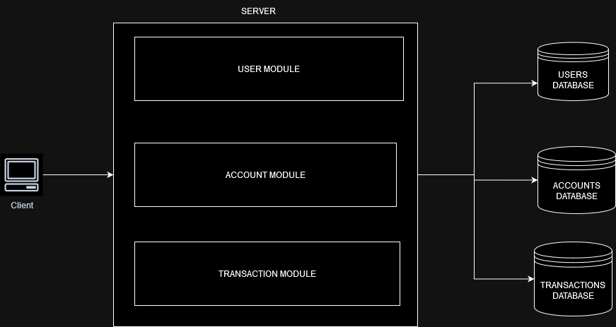
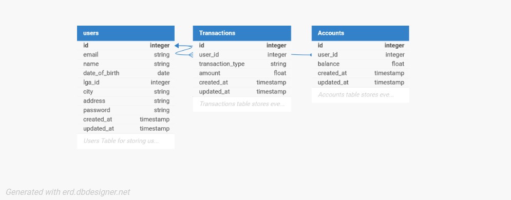

# Demo Credit Wallet Application

## Overview

The Demo Credit Wallet Application is a secure platform that allows users to create accounts, fund their accounts, withdraw funds, and transfer money between users. This application is built using Node.js, Express, and TypeScript, with a PostgreSQL database for persistent storage.

## Features

- **User Registration**: Users can create an account by providing necessary information.
- **Account Funding**: Users can deposit funds into their accounts.
- **Withdrawal**: Users can withdraw funds from their accounts.
- **Fund Transfer**: Users can transfer funds to other users via their email.
- **Transaction History**: Users can view their transaction history for transparency.
- **View Account**: Users can view their account information.

## Architecture

This application uses a modular design architecture in a monolith application. This approach allows separation of concerns, enabling different components of the application to be developed, tested, and maintained independently while still operating as a cohesive unit. 

The three modules are `User` Module, `Account` Module, `Transaction` Module. Below is an architecture diagram of the application.



The `User` module handles every feature related to user and authentication like login and register. While the `Account` module handles everything related to an account like funding, withdrawal and transfers and the `Transactions` module handles everything related to a user transaction history.

The main advantages and reasons for this design decision is with a modular architecture, scalabilty is easily implemented as if needed, specific modules can be extracted and transitioned into microservices without a complete rewrite of the application.  

## Database

This application database has three tables `Users`, `Transactions` and `Accounts`. Below is a database ER diagram showing the relationships between the tables.



As you can see above the `Users` table has a one to many relationship with the `Transactions` tables because each user will have multiple transactions stored on the table connected to that user. Also the `Users` table has a one to one relationship with the `Accounts` table because a user can only have one account which is referenced by the `user.id` and `account.user_id`;


### Tech Stack

- **Backend**: Node.js, Express, TypeScript
- **Database**: MySQL
- **ORM**: Knex.js
- **Testing Framework**: Jest

## API Endpoints

### User Registration

- **Endpoint**: `POST /api/auth/register`
- **Request Body**:
    ```json
    {
    "name": "user name",
    "address": "address",
    "email": "test@gmail.com",
    "city": "Enugu",
    "date_of_birth": "2001-01-12",
    "lga_id": "12",
    "password": "password"
    }
    ```
- **Response**:
    - **Success**: `statusCode: 201`
    ```json
    {
    "user": {
        "id": 8,
        "email": "test@gmail.com",
        "name": "user name",
        "date_of_birth": "2001-01-12T00:00:00.000Z",
        "lga_id": 12,
        "city": "Enugu",
        "address": "11 Animat Street",
        "created_at": "2024-11-01T07:09:53.000Z",
        "updated_at": "2024-11-01T07:09:53.000Z"
    },
    "message": "success"
    }
    ```
    - **Error**: `statusCode: 400`
    ```json
    {
    "message": "User with email address already exists"
    }
    ```

### Fund User Account

- **Endpoint**: `POST /api/accounts/fund`
- **Headers**: `Authorization: Bearer <token>`
- **Request Body**:
    ```json
    {
      "userId": 1,
      "amount": 100
    }
    ```
- **Response**:
    - **Success**: `{ "message": "Funds added successfully", "statusCode": 200, "account": { "balance": 300 } }`
    - **Error**: `{ "message": "Account not found", "statusCode": 404 }`

### Withdraw Amount

- **Endpoint**: `POST /api/accounts/withdraw`
- **Headers**: `Authorization: Bearer <token>`
- **Request Body**:
    ```json
    {
      "userId": 1,
      "amount": 50
    }
    ```
- **Response**:
    - **Success**: `{ "message": "Withdrawal successful", "statusCode": 200, "account": { "balance": 250 } }`
    - **Error**: `{ "message": "Insufficient funds", "statusCode": 402 }`

### Transfer Amount

- **Endpoint**: `POST /api/accounts/transfer`
- **Headers**: `Authorization: Bearer <token>`
- **Request Body**:
    ```json
    {
      "senderId": 1,
      "receiverEmail": "receiver@example.com",
      "amount": 30
    }
    ```
- **Response**:
    - **Success**: `{ "message": "Transfer successful", "statusCode": 200, "account": { "balance": 220 } }`
    - **Error**: `{ "message": "Receiver account not found", "statusCode": 404 }`

### Get User Account

- **Endpoint**: `GET /api/accounts/:userId`
- **Headers**: `Authorization: Bearer <token>`
- **Response**:
    - **Success**: `{ "message": "Account retrieved successfully", "statusCode": 200, "account": { "balance": 220, "email": "user@example.com" } }`
    - **Error**: `{ "message": "Account not found", "statusCode": 404 }`